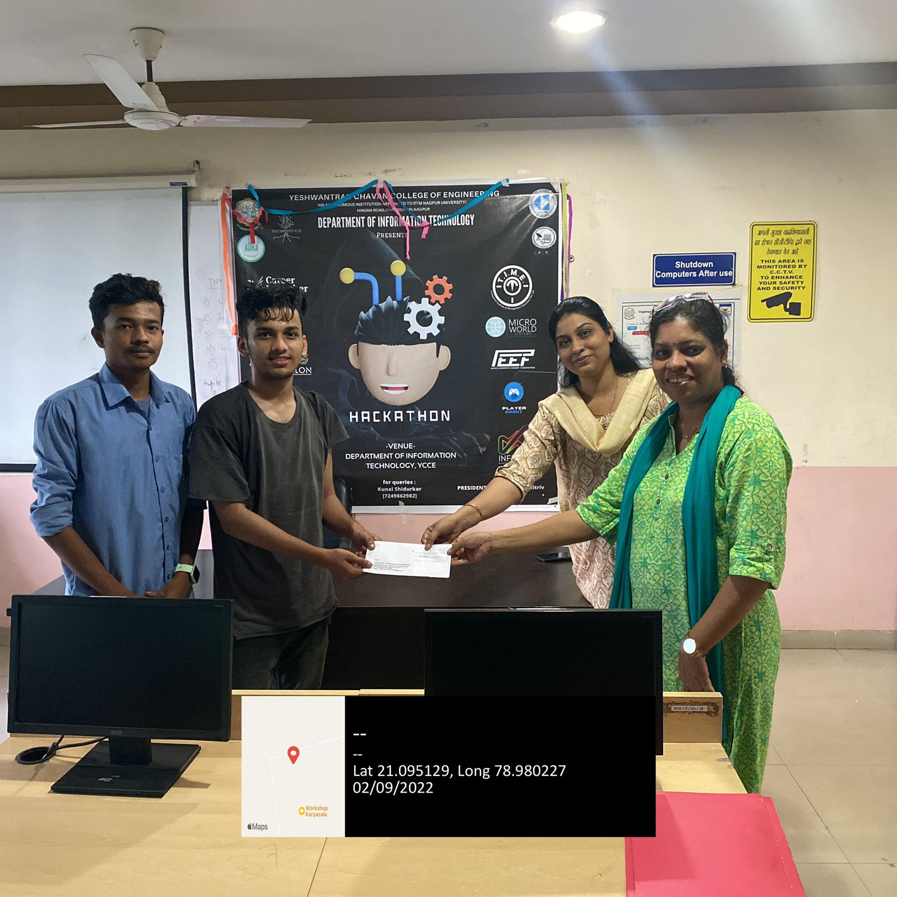

# Datanoid - Data Science Learning Platform


*Winner of IT Hackathon 2022 (YCCE)*  

Datanoid is an innovative data science learning platform created to simplify the journey of learning data science. The platform was developed during the **IT Hackathon 2022** and won **1st Prize** in the **Web Technology Category**.

## 🌟 Features
- **Interactive Learning Modules**: Learn core concepts of data science through structured content.
- **Hands-On Challenges**: Practice coding tasks to strengthen your skills.
- **Clean and Simple Design**: Built with HTML, CSS, and JavaScript for a seamless user experience.
- **Responsive Interface**: Optimized for both desktop and mobile devices.

## 🏆 Achievement
Datanoid was recognized as the **best project** for its innovative and user-friendly approach to teaching data science.  

## 🔗 Live Demo
Check out the deployed platform: [Datanoid](https://datanoid.vercel.app/)

## 🛠️ Built With
- **HTML**: Structure of the web pages.
- **CSS**: Styling for a visually appealing design.
- **JavaScript**: Dynamic functionality and interactivity.

## 📸 Highlight
  
*Receiving the prize money at IT Hackathon 2022.*

## 📚 How to Use
1. Clone this repository:
   ```bash
   git clone https://github.com/your-username/datanoid.git
   ```
2. Navigate to the project directory:
   ```bash
   cd datanoid
   ```
3. Open `index.html` in your browser to view the project.

## 👥 Team
- **Yash Patle**  
- **Sahil Mohurale**
- **Priya Kriplani**
- **Radhika Bhoyar**

---

Feel free to fork this repository and contribute to making **Datanoid** even better!
